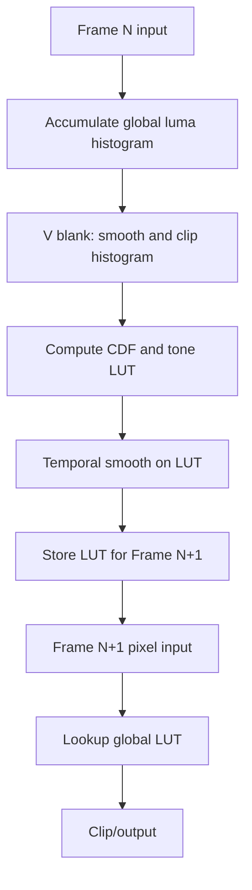
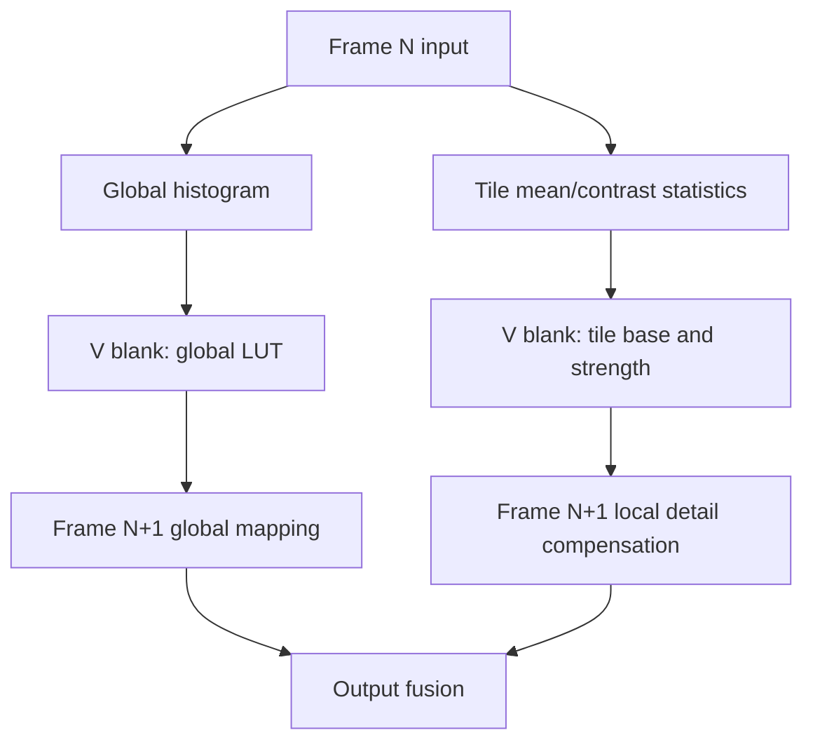

# DDIC 图像对比度增强算法设计交付文档（V1）

## 1. 文档信息
- 算法名称：DDIC 低复杂度图像对比度增强
- 版本：v0.1
- 作者：Codex
- 日期：2026-03-06
- 目标平台：DDIC 视频链路
- 核心约束：
  - 允许第 `N` 帧统计、第 `N+1` 帧应用
  - 增强参数在 `V blank` 中计算
  - 第 `N+1` 帧像素路径必须极简
  - `line buffer` 资源非常紧张，无法落地 tile 局部增强
- 文档定位：
  - 本文档作为 `V1` 算法交付稿，面向 DDIC 数字实现、验证和系统调参团队
  - 本文档默认在线处理亮度通道，色度路径直通
  - 本文档不覆盖后续 `tile` 版本的实现细节，仅保留其思路

## 2. 问题定义与接口

### 2.1 目标
- 在 DDIC 资源受限条件下提升暗部层次和整体主观对比度。
- 算法应保持稳定，避免视频闪烁、肤色异常、亮部发灰和噪声放大。
- 实现侧优先考虑 `LUT`、`PWL`、加减、比较、少量乘法，避免复杂局部滤波。

### 2.2 输入输出接口
| 信号 | 方向 | 含义 | 位宽 | 备注 |
|---|---|---|---:|---|
| `R/G/B in` 或 `Y in` | 输入 | 当前像素输入 | 8~10 bit | 推荐在亮度域处理 |
| `Hist_N` | 统计输入 | 第 `N` 帧亮度统计 | 32 或 64 bin | 帧末完成 |
| `LUT_{N+1}` | 控制输入 | 第 `N+1` 帧使用的 tone LUT | 256 x 8/10/12 bit | 双缓冲 |
| `R/G/B out` 或 `Y out` | 输出 | 增强后像素 | 8~10 bit | 在线仅查表和限幅 |

### 2.3 I/O 合同
#### 2.3.1 输入条件
- 输入视频流按行、按像素顺序到达，不允许在线回看整帧。
- 当前帧统计在像素输入期间同步进行。
- `V blank` 提供一段连续计算窗口，用于生成下一帧 LUT。

#### 2.3.2 输出要求
- 对任意输入码值 `Y_in`，在线路径必须在单次 LUT 查询后得到 `Y_out`。
- 输出 LUT 必须满足单调非降和边界受限：
\[
0 \le T(i) \le Y_{max}, \quad T(i+1) \ge T(i)
\]
- 新 LUT 必须只在帧边界切换，不允许在活动显示区中途更新。

#### 2.3.3 失效保护
- 若当帧 histogram 无效、溢出或 `V blank` 计算未完成，则沿用前一帧 LUT。
- 若 CE 模块关闭，则直通：
\[
Y_{out} = Y_{in}
\]

## 3. 约束驱动的总体结论

### 3.1 当前可落地主线
当前最现实的实现方向是：

1. 第 `N` 帧只做全局亮度统计。
2. 在 `V blank` 中生成第 `N+1` 帧使用的全局 tone curve。
3. 第 `N+1` 帧在线路径只做 `LUT` 查询和可选的极少量线性修正。

推荐优先级：

1. `V1`：受限直方图重分布生成全局 LUT（默认 `32 bin`，可选 `64 bin`）
2. `V2`：在 `V1` 基础上加入自适应 gamma / S 曲线混合
3. `V3`：若未来资源允许，再考虑局部增强思路

### 3.2 当前不落地但保留的思路
`tile` 局部增强是有价值的方向，但由于需要额外的局部统计、参数缓存和近似局部基底估计，对当前 `line buffer` 和在线数据通路不友好，因此本版本不采用，仅作为后续资源宽松时的储备方案。

## 4. 保留思路：Tile 局部增强方案

### 4.1 设计目的
纯全局 LUT 的主要短板是：
- 同一帧中暗区和亮区并存时，一条全局曲线难以兼顾两侧层次。
- 局部细节提升有限，暗背景下的小结构容易仍然发闷。

因此保留一个未来方向：`全局 LUT 负责主映射，tile 参数负责局部细节补偿`。

### 4.2 核心思想
不为每个 tile 生成完整 `LUT`，只为每个 tile 保存两个局部参数：

- `B_t`：tile 局部基底亮度
- `A_t`：tile 局部增强强度

在线像素计算为：

\[
Y_g = T(Y)
\]
\[
D = Y - B(x, y)
\]
\[
Y_{out} = \mathrm{clip}(Y_g + A(x, y)\cdot D)
\]

其中：
- `T(Y)` 为全局 tone LUT
- `B(x, y)` 为由周围 tile 的 `B_t` 双线性插值得到的局部基底
- `A(x, y)` 为由周围 tile 的 `A_t` 双线性插值得到的局部强度

### 4.3 Tile 统计内容
若未来实现该方案，建议每个 tile 统计：

1. `mean_t`
\[
mean_t = \frac{1}{N_t}\sum_{i\in tile} Y_i
\]

2. `contrast_t`

标准版可基于 16-bin tile 直方图得到：
\[
contrast_t = P90_t - P4_t
\]

轻量版可退化为平均绝对偏差：
\[
mad_t = \frac{1}{N_t}\sum_{i\in tile}|Y_i - mean_t|
\]

### 4.4 Tile 参数生成
在 `V blank` 中根据 tile 平均亮度和 tile 对比度，通过两个小查找表得到：

\[
\alpha_b = F_B(mean_t)
\]
\[
\alpha_c = F_C(contrast_t)
\]
\[
A_t = K \cdot \alpha_b \cdot \alpha_c
\]

其中：
- `F_B`：亮度保护曲线，极亮和极暗区域降低增强
- `F_C`：对比度保护曲线，低对比和过高对比区域降低增强

`B_t` 和 `A_t` 在 tile 域先做空域平滑，再做时域平滑：

\[
B_t^{(f)}[n] = (1-k_b)\cdot B_t^{(f)}[n-1] + k_b \cdot B_t^{(s)}[n]
\]
\[
A_t^{(f)}[n] = (1-k_a)\cdot A_t^{(f)}[n-1] + k_a \cdot A_t^{(s)}[n]
\]

### 4.5 该思路的价值
- 不需要每个 tile 保存完整 tone curve，资源优于 CLAHE 类方案。
- 局部提升比纯全局 LUT 更明显。
- 参数可解释、可调，适合作为未来高阶版本。

### 4.6 当前不采用的原因
- 需要局部统计通路和额外缓存。
- 在线还需要 tile 参数插值，不是最极简像素链路。
- 当前 `line buffer` 资源不足，难以低风险实现。

结论：`保留为 idea，不进入当前 tape-out 或当前版本主实现。`

## 5. 当前主实现：无 Tile 的全局动态对比度增强

### 5.1 总体结构
当前主方案采用：

1. 第 `N` 帧累计全局亮度直方图
2. `V blank` 中生成受限、平滑、单调的全局 tone LUT
3. 第 `N+1` 帧按 LUT 直接映射输出

这是一条最符合 DDIC 限制的主线。

`V1` 的固定决策如下：
- histogram：`32/64 bin` 可配置，默认 `32 bin`
- tone curve：仅采用 `pure clip-limited CDF`
- 不引入 gamma 混合
- 不引入局部补偿
- 第 `N+1` 帧在线路径只保留单次 `LUT` 查询

### 5.2 符号定义
| 符号 | 含义 | 范围 |
|---|---|---|
| `Y` | 输入亮度 | `[0, 255]` 或 `[0, 1023]` |
| `h[k]` | 第 `k` 个直方图 bin 计数 | 非负整数 |
| `\hat{h}[k]` | 平滑/限幅后的 bin 值 | 非负整数 |
| `cdf[k]` | 累积分布函数 | `[0, 1]` |
| `T(Y)` | tone mapping 曲线 | 单调非降 |
| `Y_out` | 输出亮度 | `[0, 255]` 或 `[0, 1023]` |

### 5.3 第 N 帧统计
建议只统计全局亮度：

- 直方图 bin 数：`32` 或 `64`，默认 `32`
- 同步派生辅助统计：
  - 平均亮度 `mean`
  - 暗像素占比 `r_dark`
  - 亮像素占比 `r_bright`
  - 有效动态范围近似值 `dr = P98 - P2`

建议第一个版本从 `32 bin` 起步，足够做稳定控制，硬件更省；`64 bin` 作为可选升级项保留。

#### 5.3.1 Bin 索引
对 `B` 个 histogram bins，输入亮度的 bin 索引定义为：

\[
bin(Y) = \left\lfloor \frac{Y \cdot B}{Y_{max}+1} \right\rfloor
\]

其中：
- `B = 32` 或 `64`
- `Y_{max} = 255` 或 `1023`

为便于硬件实现，可将该映射改写为移位或常数乘法。例如在 8bit 输入下：
- `32 bin`：`bin(Y) = Y[7:3]`
- `64 bin`：`bin(Y) = Y[7:2]`

#### 5.3.2 辅助统计定义
辅助统计建议直接由 histogram 导出，而非额外逐像素统计：

\[
mean \approx \frac{1}{N_{pix}}\sum_{k=0}^{B-1} c_k \cdot h[k]
\]

\[
r_{dark} = \frac{\sum_{k=0}^{k_d} h[k]}{N_{pix}}, \quad
r_{bright} = \frac{\sum_{k=k_b}^{B-1} h[k]}{N_{pix}}
\]

其中 `c_k` 为第 `k` 个 bin 的中心亮度。

### 5.4 V blank 中的 LUT 生成

#### 5.4.1 Bin 平滑
先对直方图做 1D 平滑，降低帧内尖峰：

\[
h_s[k] = \frac{h[k-1] + 2h[k] + h[k+1]}{4}
\]

边界 bin 使用镜像或重复边界值。

#### 5.4.2 Clip limit
对平滑后的直方图做限幅，避免 HE 过增强：

\[
h_c[k] = \min(h_s[k], H_{clip})
\]

其中 `H_clip` 可取：

\[
H_{clip} = \lambda \cdot \frac{N_{pix}}{N_{bin}}
\]

经验上 `\lambda` 可在 `1.5 ~ 3.0` 之间调节。

#### 5.4.3 Redistribute
将 clip 掉的多余计数均匀或按权重回灌到各 bin，得到：

\[
\hat{h}[k]
\]

这是为了保持 CDF 单调和亮度守恒近似。

第一版推荐均匀回灌，便于实现：

\[
E = \sum_{k=0}^{B-1}\max(h_s[k] - H_{clip}, 0)
\]
\[
q = \left\lfloor \frac{E}{B} \right\rfloor, \quad r = E - qB
\]
\[
\hat{h}[k] = \min(h_s[k], H_{clip}) + q + \delta(k < r)
\]

其中 `\delta(\cdot)` 为示性函数。该形式可用整数除法或查表近似实现。

#### 5.4.4 CDF 计算
\[
cdf[k] = \frac{\sum_{i=0}^{k}\hat{h}[i]}{\sum_{i=0}^{N_{bin}-1}\hat{h}[i]}
\]

若 `\sum \hat{h}[i] = N_{pix}`，则分母可直接使用总像素数。为避免在线除法，推荐在 `V blank` 中预先计算缩放因子：

\[
S_{cdf} = \left\lfloor \frac{2^Q \cdot Y_{max}}{N_{pix}} \right\rfloor
\]
\[
T_{raw}[k] = \left( \sum_{i=0}^{k}\hat{h}[i] \right) \cdot S_{cdf}
\]

最后再右移 `Q` 位得到对应输出码值。

#### 5.4.5 Tone curve 生成
`V1` 只采用纯 `clip-limited CDF` 生成曲线：

\[
T(Y) = Y_{min} + (Y_{max} - Y_{min})\cdot cdf[bin(Y)]
\]

其中：
- `Y_{min}` 和 `Y_{max}` 可取输入位宽的全范围
- `bin(Y)` 为亮度映射到 histogram bin 的索引
- `T(Y)` 为单调非降 LUT

`V1` 不做 identity 混合，不做 gamma 混合，优先保证实现简单和行为可预测。

推荐在 `V blank` 中直接展开为逐码值 LUT：

\[
LUT[i] = T(i), \quad i = 0,1,\dots,255
\]

对 `32/64 bin` 到 `256 LUT` 的展开，推荐采用分段线性插值：

\[
LUT[i] = (1-w_i)\cdot T_{bin}[k] + w_i \cdot T_{bin}[k+1]
\]

其中：
- `k = bin(i)`
- `w_i` 为该码值在 bin 内的位置权重

这样在线仍然只查一次 `LUT`，但比逐 bin 平台映射更平滑。

#### 5.4.6 帧间平滑
为防止视频闪烁，LUT 应做时域平滑：

\[
T_f^{(n+1)}(i) = (1-\alpha)\cdot T_f^{(n)}(i) + \alpha \cdot T_{new}(i)
\]

建议：
- 快速亮度变化场景：较大 `\alpha`
- 一般场景：`0.125 ~ 0.25`

#### 5.4.7 V1 控制策略
`V1` 不引入额外增强强度 `\beta`。场景控制仅通过以下参数完成：

- `N_bin`：`32` 或 `64`
- `H_clip`：clip limit
- `\alpha`：LUT 时域平滑系数

这三个参数已经足以覆盖第一版最核心的画质-稳定性权衡。

如后续需要更强的场景自适应，可在 `V2` 中再加入 `\beta` 或 gamma 混合。

#### 5.4.8 单调性与边界约束
为了避免 LUT 折返和局部伪影，生成 `T(Y)` 后需强制满足：

\[
T(i+1) \ge T(i)
\]
\[
0 \le T(i) \le Y_{max}
\]

建议后处理为：

\[
T_m(0) = \max(0, T(0))
\]
\[
T_m(i) = \max(T_m(i-1), T(i))
\]

再对末端做上限裁剪。

该步骤代价低，但对显示稳定性和工程鲁棒性非常重要。

### 5.5 第 N+1 帧在线像素计算
最简实现：

\[
Y_{out} = T_f(Y_{in})
\]

如果后续需要极小幅度的线性补偿，可扩展为：

\[
Y_{out} = \mathrm{clip}(g\cdot T_f(Y_{in}) + o)
\]

其中 `g` 和 `o` 在 `V blank` 中预先生成，但第一版建议不加，先用纯 LUT 跑通。

### 5.6 边界与失效模式
- 若整帧几乎全黑或全白，clip 和 CDF 仍需保证 LUT 单调且不越界。
- 若输入场景变化极快，LUT IIR 可能带来一帧到数帧滞后，这是预期行为。
- 若 `CLIP_GAIN` 过高，则暗噪声和压缩噪声更容易被抬起。
- 若 `ALPHA_LUT_IIR` 过低，则动态场景响应偏慢；过高则易闪烁。

## 6. 定点化建议

### 6.1 数据格式
| 变量 | 建议格式 | 说明 |
|---|---|---|
| 输入 `Y` | U8.0 或 U10.0 | 取决于链路位宽 |
| histogram bin | U24.0 ~ U28.0 | 视分辨率而定 |
| 归一化 `cdf` | Q0.12 或 Q0.14 | 足够生成 8~10 bit LUT |
| LUT 输出 | U8.0 或 U10.0 | 与输出位宽一致 |
| 平滑系数 `\alpha` | Q0.8 | 便于乘法近似 |

### 6.2 乘法简化
- `1/4`、`1/8`、`1/16` 优先用移位实现。
- 时域平滑建议选 `\alpha = 1/8` 或 `1/4`，减少乘法器压力。
- 若后续进入 `V2`，再考虑额外混合系数的档位化实现。

### 6.3 位宽估算示例
以 `1920 x 1080` 分辨率为例：

\[
N_{pix} = 1920 \times 1080 = 2{,}073{,}600
\]

直方图单 bin 最大计数至少需要：

\[
\lceil \log_2(2{,}073{,}600) \rceil = 21 \text{ bit}
\]

因此：
- `32 bin histogram`：`32 x 21 = 672 bit`
- `64 bin histogram`：`64 x 21 = 1344 bit`
- 双缓冲 `64 bin`：`2688 bit`

若输出为 `10 bit`，则：
- `256 entry LUT`：`256 x 10 = 2560 bit`
- 双缓冲 LUT：`5120 bit`

可见对当前主方案，核心存储压力主要不在 LUT，而在是否引入更复杂的局部统计。

### 6.4 推荐定点档位
| 变量 | 推荐位宽 | 说明 |
|---|---|---|
| `r_dark`, `r_bright` | Q0.8 | 比例量 |
| `dr_norm` | Q0.8 | 归一化动态范围 |
| `cdf[k]` | Q0.12 | 生成 8~10 bit LUT 足够 |
| `T(i)` 中间值 | U12.4 或 U14.4 | 用于缩放和再量化 |

推荐在 LUT 最终写回前统一做一次舍入和饱和。

## 7. 硬件资源估计

### 7.1 当前主方案
| 模块 | Add/Sub | Mul | LUT访问 | Compare | SRAM |
|---|---:|---:|---:|---:|---:|
| 第 N 帧全局 histogram | 1 | 0 | 0 | 0 | `32~64` bins |
| V blank 平滑/clip/CDF | 中等 | 少量 | 0 | 少量 | 直方图缓冲 |
| 第 N+1 帧在线映射 | 0~1 | 0 | 1 | 1 | LUT 双缓冲 |

若按 `64 bin + 256 LUT` 估算：
- 在线像素代价近似为 `1 次 LUT 读取 + 1 次限幅`
- `V blank` 计算量近似与 `N_bin + LUT_size` 成线性关系
- 总体复杂度远低于任何 tile 局部方案

#### 7.1.1 逐阶段操作量估算
按 `64 bin + 256 LUT` 估算，每帧 `V blank` 侧大致需要：

| 阶段 | Add/Sub | Mul/Shift | Compare | 备注 |
|---|---:|---:|---:|---|
| bin 平滑 | `2B` | `B` 次右移 | 0 | `B = 64` |
| clip + excess | `B` | 0 | `B` | excess 累积 |
| redistribute | `B` | 少量 | 少量 | 可共享算术单元 |
| CDF | `B` | 0 | 0 | 前缀和 |
| LUT 展开 | `256` 级 | `256` 级 | 少量 | 可用线性插值 |
| LUT IIR | `256` | `256` | 0 | `alpha = 1/8` 时可移位 |
| 单调修正 | `256` | 0 | `256` | prefix-max |

结论：`V1` 的复杂度主要集中在 `V blank`，且全部是可流水或复用的小规模整数运算。

### 7.2 Tile 方案额外代价（保留，不落地）
| 模块 | Add/Sub | Mul | LUT访问 | Compare | SRAM |
|---|---:|---:|---:|---:|---:|
| tile 统计 | 高 | 0~少量 | 0 | 中等 | tile 计数/均值缓存 |
| tile 参数生成 | 中等 | 少量 | 2 | 少量 | tile 参数表 |
| 在线双线性插值 | 中等 | 少量 | 0 | 0 | 邻域 tile 读取 |

结论：tile 方案相比全局 LUT 方案，在线和离线复杂度都明显上升。

### 7.3 V blank 时序预算示例
以下仅为 `1080p60` 常见时序下的估算示例，用于说明量级，不作为固定规格。

若总行数为 `1125`，有效行数为 `1080`，则垂直 blank 行数约为 `45`。
若每行总像素时钟为 `2200`，则 `V blank` 可用时钟约为：

\[
N_{vblank} = 45 \times 2200 = 99{,}000 \text{ cycles}
\]

对于 `64 bin + 256 LUT` 的 V1 实现，典型步骤可估算为：

| 步骤 | 规模 | 估计 cycles |
|---|---:|---:|
| histogram bin 平滑 | 64 | `64 ~ 128` |
| clip + excess 统计 | 64 | `64 ~ 128` |
| excess redistribute | 64 | `64 ~ 128` |
| CDF 累加 | 64 | `64 ~ 128` |
| 生成 256 点 LUT | 256 | `256 ~ 1024` |
| LUT 时域平滑 | 256 | `256 ~ 512` |
| 单调性修正 | 256 | `256 ~ 512` |

即便按保守估计，总量通常也在几千 cycles 量级，远低于上述 `99k cycles` 示例预算。

结论：只要不引入复杂 tile 统计和逐点局部运算，`V blank` 完成全局 LUT 计算是现实可行的。

### 7.4 实现侧建议
- Histogram 和 LUT 均使用双缓冲或 ping-pong 结构。
- `V blank` 任务调度顺序固定化，避免跨帧状态污染。
- 所有控制参数在帧切换点一次性锁存，避免一帧中途变化。
- 第一版尽量不引入除法器，可通过预缩放、查表或移位近似替代。

## 8. 流程图

### 8.1 当前主实现

### 8.2 保留的 Tile 思路

## 9. 实施路线建议

### 9.1 V1：可量产基线
- 仅实现全局 `32/64 bin histogram`，默认 `32 bin`
- 实现 bin 平滑、clip limit、CDF、LUT 双缓冲
- tone curve 仅使用 `pure clip-limited CDF`
- 在线只做 `Y_out = LUT(Y_in)`
- 先建立视频稳定性和主观画质基线

### 9.2 V2：画质增强版
- 在 `V blank` 中加入自适应 `\beta`
- 混合 `identity / gamma / HE` 曲线
- 增加高亮保护和暗噪声保护

### 9.3 V3：未来资源开放时
- 重新评估 tile 统计资源
- 若 line buffer / SRAM 允许，导入 tile base + tile strength 方案
- 避免直接走 CLAHE 或每 tile LUT 路线

## 10. 验证建议

### 10.1 画质
- 暗场细节是否提升
- 高亮区域是否发灰
- 人脸/肤色是否异常
- 文本/UI 边缘是否过冲

### 10.2 视频稳定性
- 场景切换是否闪烁
- 相邻帧 LUT 变化是否平滑
- 静止画面是否出现 pumping

### 10.3 硬件
- `V blank` 时间内是否能完成 LUT 计算
- LUT 双缓冲切换是否安全
- 统计位宽是否溢出

### 10.4 功能验证向量
建议至少覆盖以下输入分布：

| 向量编号 | 输入特征 | 期望行为 |
|---|---|---|
| `VEC-01` | 全黑帧 | 输出保持全黑或极接近全黑，不应抬底 |
| `VEC-02` | 全白帧 | 输出保持全白或极接近全白，不应反转 |
| `VEC-03` | 线性灰阶 ramp | 输出单调，不能出现折返 |
| `VEC-04` | 低对比窄分布灰阶 | 输出动态范围应明显拉开 |
| `VEC-05` | 双峰分布 | 两个峰值区域都应保持次序 |
| `VEC-06` | 场景切换序列 | LUT 更新不应产生明显闪烁 |
| `VEC-07` | 带噪暗场 | 不应出现明显噪声爆炸 |

### 10.5 定点一致性
- 浮点参考模型与定点模型比较：
  - LUT 最大码值误差 `<= 1 LSB`
  - 单调性错误数 `= 0`
  - 边界越界数 `= 0`
- 对 `32 bin` 与 `64 bin` 分别独立验证。

### 10.6 硬件可实现性验收
- `V blank` 计算在目标分辨率和帧率下完成，且保留安全余量
- histogram 计数无溢出
- LUT ping-pong 切换只发生在帧边界
- 在线路径组合逻辑满足像素时钟时序

### 10.7 建议验收标准
- 单调性：LUT 全表满足 `T(i+1) >= T(i)`
- 稳定性：静止场景下连续帧 LUT 变化小于预设阈值
- 资源：主方案不引入额外 line buffer
- 在线复杂度：像素路径不包含直方图、局部窗口滤波和复杂除法
- 主观画质：暗场有提升，高亮不过压，视频无明显 pumping

## 11. V1 默认参数建议

### 11.1 默认配置
| 参数 | 默认值 | 可选范围 | 说明 |
|---|---:|---:|---|
| `HIST_BIN_MODE` | `32` | `32 / 64` | 默认 `32`，`64` 为可选升级 |
| `LUT_SIZE` | `256` | 固定 | 对 8bit 亮度直接查表 |
| `ALPHA_LUT_IIR` | `1/8` | `1/16 ~ 1/4` | LUT 帧间平滑系数 |
| `CLIP_GAIN` | `2.0` | `1.5 ~ 3.0` | 对应 `H_clip = CLIP_GAIN * N_pix / N_bin` |
| `BIN_SMOOTH_EN` | `1` | `0 / 1` | 默认启用直方图 bin 平滑 |
| `MONOTONIC_EN` | `1` | `0 / 1` | 默认启用 LUT 单调修正 |

### 11.2 调参方向
- `N_bin` 从 `32` 升到 `64`：曲线更细，但 V blank 计算和控制复杂度略增
- `CLIP_GAIN` 增大：增强更强，但更易过增强和抬噪
- `ALPHA_LUT_IIR` 增大：响应更快，但更易闪烁
- `BIN_SMOOTH_EN` 关闭：曲线更敏感，但更易受单帧尖峰影响

## 12. 建议寄存器/配置接口

| 寄存器名 | 位段 | 含义 |
|---|---|---|
| `CE_CTRL_0` | `[0]` | `ce_en`，总开关 |
| `CE_CTRL_0` | `[1]` | `hist_bin_mode`，`0:32bin, 1:64bin` |
| `CE_CTRL_0` | `[2]` | `bin_smooth_en` |
| `CE_CTRL_0` | `[3]` | `monotonic_en` |
| `CE_CTRL_1` | `[7:0]` | `clip_gain_cfg`，Q4.4 或查表索引 |
| `CE_CTRL_2` | `[7:0]` | `alpha_lut_iir`，Q0.8 |
| `CE_STATUS_0` | `[0]` | `hist_done` |
| `CE_STATUS_0` | `[1]` | `lut_update_done` |
| `CE_STATUS_1` | `[15:0]` | 可选 debug/status，例如有效 clip 次数或场景标签 |

寄存器原则：
- 第一版控制项尽量少，避免过早暴露复杂调参面
- `32/64 bin`、`clip gain`、`alpha` 是最值得保留的调节接口

## 13. V blank 状态机流程

建议将 `V blank` 处理做成固定顺序状态机：

1. `S0_IDLE`
等待帧结束和 histogram 锁存完成。

2. `S1_LOAD_HIST`
读取当前帧 histogram 到计算缓冲。

3. `S2_BIN_SMOOTH`
执行 bin 平滑：
\[
h_s[k] = \frac{h[k-1] + 2h[k] + h[k+1]}{4}
\]

4. `S3_CLIP`
执行 clip limit，并累计 excess。

5. `S4_REDISTRIBUTE`
将 excess 回灌到各 bin，得到 `\hat{h}[k]`。

6. `S5_CDF`
做前缀和计算 `cdf[k]`。

7. `S6_GEN_LUT`
根据 `cdf[bin(Y)]` 生成 `256` 点 LUT。

8. `S7_LUT_IIR`
将新 LUT 与前一帧 LUT 做时域平滑。

9. `S8_MONOTONIC_FIX`
执行单调修正和边界裁剪。

10. `S9_SWAP`
切换 LUT ping-pong buffer，准备供第 `N+1` 帧使用。

### 13.1 状态机实现建议
- 各状态都应支持单周期或少周期迭代，不依赖复杂除法器
- `S5_CDF` 和 `S6_GEN_LUT` 可共用同一算术资源
- `S9_SWAP` 必须只发生在帧边界，避免一帧中途换表

### 13.2 状态机与公式映射
| 状态 | 对应公式或操作 |
|---|---|
| `S2_BIN_SMOOTH` | `h_s[k] = (h[k-1] + 2h[k] + h[k+1]) / 4` |
| `S3_CLIP` | `h_c[k] = min(h_s[k], H_clip)` |
| `S4_REDISTRIBUTE` | `\hat{h}[k] = h_c[k] + q + \delta(k<r)` |
| `S5_CDF` | `cdf[k] = \sum_{i=0}^{k}\hat{h}[i] / N_pix` |
| `S6_GEN_LUT` | `LUT[i] = T(i)` |
| `S7_LUT_IIR` | `T_f = (1-\alpha)T_{old} + \alpha T_{new}` |
| `S8_MONOTONIC_FIX` | `T_m(i) = max(T_m(i-1), T(i))` |

## 14. 结论
- `tile` 局部增强是正确且有前景的思路，但当前资源条件下不落地。
- 当前应集中实现“受限直方图重分布 + 时域平滑 + 全局 LUT”的主方案。
- `V1` 默认配置确定为：`32 bin` + `pure clip-limited CDF` + `LUT IIR`
- 这条路线最符合 `N 帧统计、V blank 计算、N+1 帧极简应用` 的 DDIC 实际约束。
