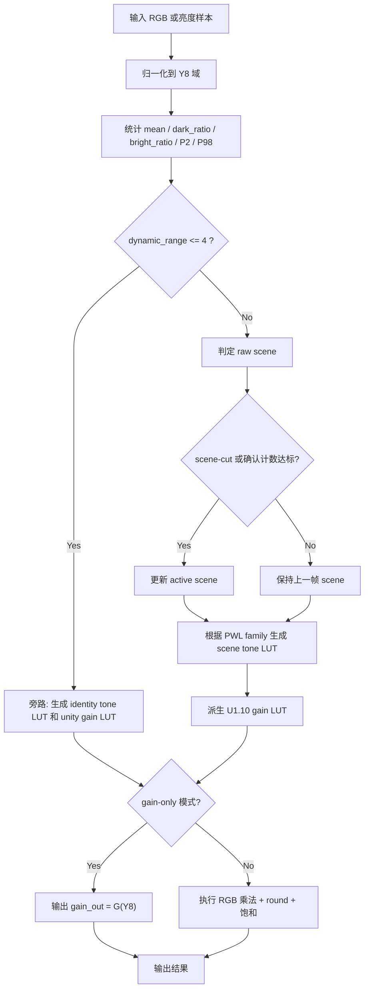

# 对比度增强 MATLAB 硬件运行时设计说明

本文档是 `matlab/` 目录下 MATLAB 硬件运行时包的项目交付说明，面向算法、DDIC 数字实现、验证和 bring-up 团队。

说明约束：

- 文档描述统一使用中文
- 数学表达式统一使用代码块或行内代码，避免依赖不稳定的 Markdown LaTeX 渲染
- 文档内容以当前已经验证通过的 MATLAB 实现为准

## 1. 问题定义与 I/O 契约

### 1.1 目标

本 MATLAB 包用于描述离散场景对比度增强算法的硬件运行时版本，目标是：

- 保持 `Frame N 统计 -> 控制更新 -> 数据路径应用` 的 DDIC 风格结构
- 保持与 `src/ddic_ce_float/discrete_scene_gain.py` 的数值可追溯性
- 在不依赖 Fixed-Point Designer 的前提下，用基础 MATLAB 表达手工定点语义
- 为后续 RTL / 固件寄存器设计提供直接参考

### 1.2 输入

| 信号 | 数据域 | 位宽 | 含义 |
|---|---|---:|---|
| `rgb_in` | 原始 RGB 码值域 | 8 或 10 bit | 当前帧输入像素 |
| `prev_state` | 控制状态域 | 帧级寄存状态 | scene hold / scene-cut 相关状态 |
| `cfg` | 配置域 | struct | 阈值、Q 格式、gain 上限、knot 表 |
| `mode` | 模式控制 | 1 bit 等效 | `gain` 或 `rgb` |

### 1.3 输出

| 信号 | 数据域 | 位宽 | 含义 |
|---|---|---:|---|
| `runtime.tone_lut` | tone LUT 码值域 | `256 x 8 bit` | 当前场景的 tone LUT |
| `runtime.gain_lut` | `U1.10` | `256 x 11 bit` | 当前场景的 gain LUT |
| `out.gain_out` | `U1.10` | 每像素 11 bit | gain-only 模式输出 |
| `out.rgb_out` | 原始 RGB 码值域 | 8 或 10 bit | 本地 CE 模式输出 |
| `scene_id` | 控制域 | 2 bit | 场景标签 |
| `bypass_flag` | 控制域 | 1 bit | 旁路标志 |

### 1.4 域变换

用于统计和 gain 查表的亮度定义为：

```text
Y_8 = clip((77*R_8 + 150*G_8 + 29*B_8 + 128) / 256)
```

其中：

- `R_8/G_8/B_8` 是归一化到 `U8.0` 域后的输入通道
- `Y_8` 是 `U8.0` 亮度码值
- `clip()` 表示裁剪到 `[0, 255]`

## 2. 数学原理与推导

### 2.1 帧级统计量

对一帧共 `N` 个样本，定义：

```text
mean = (1/N) * sum(Y_8(i))
dark_ratio = count(Y_8 <= 63) / N
bright_ratio = count(Y_8 >= 192) / N
dynamic_range = P98(Y_8) - P2(Y_8)
```

旁路条件：

```text
bypass = (dynamic_range <= 4)
```

### 2.2 场景分类

当前设计使用四种离散 scene：

- `Normal`
- `Bright`
- `Dark I`
- `Dark II`

判决规则：

```text
if mean >= 168 and bright_ratio >= 0.18:
    scene = Bright
elif mean <= 56 and dark_ratio >= 0.80 and bright_ratio <= 0.02:
    scene = Dark II
elif mean <= 104 and dark_ratio >= 0.50:
    scene = Dark I
else:
    scene = Normal
```

### 2.3 曲线族与场景强度

每个 curve family 由 5 个 PWL knot 定义，记为 `F_f(y)`。

场景 tone curve 的生成形式：

```text
T_s(y) = (1 - lambda_s) * y + lambda_s * F_f(y)
```

默认映射关系：

| Scene | Family | `lambda_s` |
|---|---|---:|
| `Normal` | `Family M` | `0.50` |
| `Bright` | `Family B` | `0.65` |
| `Dark I` | `Family D` | `0.70` |
| `Dark II` | `Family M` | `0.85` |

### 2.4 Gain LUT 推导

对于 `i > 0`：

```text
G(i) = clip(T(i) * 2^10 / i, 0, 1792)
G(0) = 0
```

说明：

- `T(i)` 是 `U8.0` tone LUT 输出
- `G(i)` 是 `U1.10` gain LUT 码值
- `1792` 对应 `1.75` 的 `U1.10` 编码

### 2.5 数据路径输出

gain-only 模式：

```text
gain_out = G(Y_8)
```

本地 CE 模式：

```text
R' = sat((R * G(Y_8) + 2^9) >> 10)
G' = sat((G_in * G(Y_8) + 2^9) >> 10)
B' = sat((B * G(Y_8) + 2^9) >> 10)
```

其中：

- `sat()` 表示裁剪到合法输出码值范围
- `+ 2^9` 表示 round-to-nearest 的 bias

## 3. 定点实现策略

### 3.1 关键数据格式

| 信号 | 含义 | 实际范围 | Q 格式 | 编码范围 | 位宽 | 舍入 | 饱和 |
|---|---|---:|---|---:|---:|---|---|
| `Y_8` | 归一化亮度 | `[0,255]` | `U8.0` | `0..255` | 8 | `/256` floor | clip |
| `T(i)` | tone LUT | `[0,255]` | `U8.0` | `0..255` | 8 | `round` | clip |
| `G(i)` | gain LUT | `[0,1.75]` | `U1.10` | `0..1792` | 11 | `round` | clip |
| `R*G` | RGB 乘 gain | `[0,255*1792]` 或 `[0,1023*1792]` | 中间整数域 | 实现相关 | 19~21 | 加 bias 后右移 | clip |

### 3.2 详细信号位宽表

| Signal | 位置 | Real Range | Q Format / Type | Code Range | Recommended Width | 说明 |
|---|---|---:|---|---:|---:|---|
| `rgb_in` | datapath input | `[0,255]` or `[0,1023]` | `U8.0 / U10.0` | legal code range | 8 / 10 | 原始输入 RGB 码值 |
| `R_8/G_8/B_8` | luma normalize | `[0,255]` | `U8.0` | `0..255` | 8 | 统计域统一归一化后的通道 |
| `Y_8` | stats / index | `[0,255]` | `U8.0` | `0..255` | 8 | 直方图统计和 LUT 索引输入 |
| `histogram bin` | control path | `[0,N_pix]` | unsigned counter | implementation-defined | 20~24 | 依赖分辨率，MATLAB 中用 double/array 表示 |
| `mean` | control path | `[0,255]` | float shell / debug | - | 16+ 等效 | MATLAB 中保留浮点外壳，硬件可转控制路径除法 |
| `dark_ratio / bright_ratio` | control path | `[0,1]` | `Q0.8 ~ Q0.12` suggested | `0..255/4095` | 8~12 | 阈值比较控制量 |
| `scene_id` | control state | `{0,1,2,3}` | unsigned int | `0..3` | 2 | `Normal/Bright/Dark I/Dark II` |
| `bypass_flag` | control state | `{0,1}` | bool | `0/1` | 1 | 低动态范围旁路标志 |
| `tone_lut` | control output | `[0,255]` | `U8.0` | `0..255` | 8 | 256 点 tone curve |
| `gain_lut(U1.10)` | control output | `[0,1.75]` | `U1.10` | `0..1792` | 11 | 256 点 gain LUT |
| `gain_samples_code` | datapath | `[0,1792]` | `U1.10` | `0..1792` | 11 | 每像素查表得到的 gain |
| `mult_codes` | datapath | `[0, 1023*1792]` max | integer product | implementation-defined | 19~21 | 乘法回缩前中间结果 |
| `rgb_out` | datapath output | `[0,255]` or `[0,1023]` | `U8.0 / U10.0` | legal code range | 8 / 10 | 饱和后的输出码值 |
| `state_out.current_scene_id` | control state | `{0,1,2,3}` | unsigned int | `0..3` | 2 | 当前激活 scene |
| `state_out.pending_scene_id` | control state | `{0,1,2,3}` | unsigned int | `0..3` | 2 | 等待确认的 scene |
| `state_out.pending_count` | control state | `[0,2]` default | unsigned int | small range | 2~4 | scene hold 计数器 |
| `state_out.prev_mean` | control state | `[0,255]` | `Q8.8` suggested / float shell | implementation-defined | 16+ | scene-cut 比较参考值 |

### 3.3 浮点到硬件友好表达的替换规则

- datapath 中不保留 `exp`、`log`、在线通用除法
- 非线性行为统一替换为：
  - PWL family knot
  - identity blending
  - runtime LUT lookup
- gain 的“除法”只出现在控制路径 LUT 生成阶段

### 3.4 舍入与饱和

- LUT 量化：`round`
- 乘法回缩：`(value + 2^(F-1)) >> F`
- 最终 RGB 输出：clip 到合法 unsigned 范围
- 不使用 wrap

### 3.5 时序状态

控制路径维护以下状态：

- `current_scene_id`
- `pending_scene_id`
- `pending_count`
- `prev_mean`

scene-cut 检测规则：

```text
abs(mean_n - mean_(n-1)) >= 32
```

## 4. 硬件资源估算

### 4.1 假设

- 输入路径按 8 bit 主线估算
- 运行时只保留一套激活 LUT
- LUT 生成属于 control path，不计入像素级 datapath 延迟
- datapath 按单像素 RGB 样本处理

### 4.2 资源粗估表

| Block | Add/Sub | Mul/MAC | Compare | Mux | LUT/RAM | Notes |
|---|---:|---:|---:|---:|---:|---|
| Luma normalization | 2 add | 3 const mul | 1 clip | 0 | 0 | `77/150/29` 常数系数 |
| Scene statistics | 3 add accumulators | 0 | 3 threshold groups | 0 | 32-bin hist | 帧级控制 |
| PWL tone generation | 2 add | 1 mul | 4 segment compares | 1 | 0 | control path |
| Gain LUT generation | 1 add bias | 1 mul-equivalent / divide-like control op | 2 clamp compares | 0 | 256 x 11 bit | control path |
| Datapath core | 1 add bias / channel | 3 mul | 3 clip compares | 1 | 256 x 11 bit | 本地 CE 模式 |

### 4.3 存储估算

- Tone LUT: `256 x 8 = 2048 bits`
- Gain LUT: `256 x 11 = 2816 bits`
- Histogram counters: `32 x counter_width`
- Scene state registers: 小于 `64 bits`

### 4.4 寄存器/配置接口建议

| 寄存器名 | 位段 | 默认值 | 含义 | `cfg` 字段映射 |
|---|---|---:|---|---|
| `CE_CTRL_0` | `[0]` | `1` | `ce_en` 总开关 | 外部总使能，MATLAB 中默认 always on |
| `CE_CTRL_0` | `[1]` | `0` | `input_bit_depth_sel`, `0:8bit, 1:10bit` | `cfg.input_bit_depth` |
| `CE_CTRL_0` | `[3:2]` | `0` | force scene, `0:auto, 1:Normal, 2:Bright, 3:Dark debug` | bring-up only |
| `CE_CTRL_0` | `[4]` | `1` | `scene_hold_enable` | `cfg.scene_hold_enable` |
| `CE_CTRL_0` | `[5]` | `1` | `bypass_enable` | 与 `cfg.bypass_dynamic_range_threshold` 联动 |
| `CE_CTRL_1` | `[7:0]` | `4` | bypass dynamic range threshold | `cfg.bypass_dynamic_range_threshold` |
| `CE_CTRL_2` | `[7:0]` | `168` | bright mean threshold | `cfg.bright_mean_threshold` |
| `CE_CTRL_3` | `[7:0]` | `46` if Q0.8 | bright ratio threshold | `cfg.bright_ratio_threshold` |
| `CE_CTRL_4` | `[7:0]` | `56` | dark2 mean threshold | `cfg.dark2_mean_threshold` |
| `CE_CTRL_5` | `[7:0]` | `205` if Q0.8 | dark2 ratio threshold | `cfg.dark2_ratio_threshold` |
| `CE_CTRL_6` | `[7:0]` | `5` if Q0.8 | dark2 bright ratio threshold | `cfg.dark2_bright_ratio_threshold` |
| `CE_CTRL_7` | `[7:0]` | `104` | dark1 mean threshold | `cfg.dark1_mean_threshold` |
| `CE_CTRL_8` | `[7:0]` | `128` if Q0.8 | dark1 ratio threshold | `cfg.dark1_ratio_threshold` |
| `CE_CTRL_9` | `[7:0]` | `32` | scene-cut mean delta | `cfg.scene_cut_mean_delta` |
| `CE_CTRL_10` | `[3:0]` | `2` | scene confirm frames | `cfg.scene_switch_confirm_frames` |
| `CE_GAIN_0` | `[10:0]` | `1792` | gain 上限 | `cfg.gain_max` |
| `CE_GAIN_1` | `[4:0]` | `10` | gain 小数位数 | `cfg.gain_frac_bits` |
| `CE_CURVE_M/B/D_*` | 每个 knot 一组 | 见默认值 | 3 个 family 的 knot 表 | `cfg.family_*_knots` |
| `CE_SCENE_GAIN_0` | `[7:0]` | `128` if Q0.8 | normal strength | `cfg.normal_strength` |
| `CE_SCENE_GAIN_1` | `[7:0]` | `166` if Q0.8 | bright strength | `cfg.bright_strength` |
| `CE_SCENE_GAIN_2` | `[7:0]` | `179` if Q0.8 | dark I strength | `cfg.dark_i_strength` |
| `CE_SCENE_GAIN_3` | `[7:0]` | `218` if Q0.8 | dark II strength | `cfg.dark_ii_strength` |
| `CE_STATUS_0` | `[1:0]` | RO | 当前 `scene_id` | `runtime.scene_id` |
| `CE_STATUS_0` | `[2]` | RO | `bypass_flag` | `runtime.bypass_flag` |
| `CE_STATUS_0` | `[3]` | RO | scene-cut hit status | `state_out.prev_mean` 比较结果 |
| `CE_STATUS_1` | `[15:0]` | RO | debug/status reserve | histogram / mean / ratio debug |

### 4.5 cfg 字段映射与寄存器使用建议

- 建议常驻寄存器：
  - `input_bit_depth`
  - 所有 scene threshold
  - `gain_max`
  - `gain_frac_bits`
  - `scene_hold_enable`
- 建议调参寄存器：
  - `family_m_knots`
  - `family_b_knots`
  - `family_d_knots`
  - 四个 scene strength
- 建议 debug-only / bring-up 阶段保留：
  - force scene
  - raw `mean`
  - raw `dark_ratio`
  - raw `bright_ratio`
  - runtime `tone_lut` / `gain_lut` dump window
- 可只保留在 MATLAB/bring-up 阶段、量产不暴露：
  - `pending_scene_id`
  - `pending_count`
  - `prev_mean`

### 4.6 函数到硬件模块映射

| MATLAB 函数 | 建议硬件归属 | 说明 |
|---|---|---|
| `ce_hw_config` | 配置寄存器 / 常量 ROM | 定义默认寄存器值、Q 格式、knot 常量 |
| `ce_hw_control_update` | 帧级控制路径 | 完成统计、scene 判决、tone LUT / gain LUT 生成 |
| `ce_hw_datapath` | 像素数据路径 | 完成 `Y_8` 索引、gain 查表、乘法、round、饱和 |
| `ce_hw_helpers` | 建模辅助 | MATLAB 仿真辅助函数，不等价为独立硬件模块 |
| `run_ce_hw_case` | 运行外壳 | 单 case 调用入口，不属于核心硬件路径 |
| `run_ce_hw_batch` | 运行外壳 | 批处理脚本，不属于核心硬件路径 |
| `validate_ce_hw_against_python` | 验证外壳 | 误差统计脚本，不属于核心硬件路径 |

## 5. 算法流程图



## 6. 验证计划与验收标准

### 6.1 数值对齐验证

验证脚本必须输出：

- `max_abs`
- `mean_abs`
- `p95_abs`

当前 MATLAB 包使用 `validate_ce_hw_against_python.m`，以同一场景逻辑下的浮点 golden 重建结果作为对齐参考。

### 6.2 功能场景

必须覆盖：

- 中灰 / neutral ramp
- 亮场主导
- 暗场低高光
- 暗场混合细节
- bypass case
- gain-only 模式
- 本地 CE RGB 模式

### 6.3 验收标准

- Python 仓库测试保持通过
- MATLAB 的 `ce_hw_config`、`run_ce_hw_case`、`validate_ce_hw_against_python` 都能无错误执行
- 验证输出保持有限值
- tone LUT 保持单调
- gain LUT 保持在 `0..1792`

### 6.4 发布说明

这套 MATLAB 包是硬件运行时建模版本，不是 bit-accurate RTL 模型。它适用于：

- 算法 handoff
- Q 格式评审
- control-path / datapath 讨论
- 早期数值对齐验证
