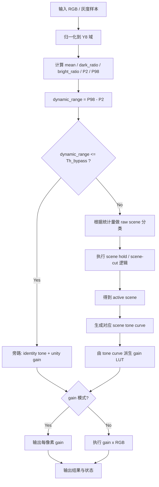
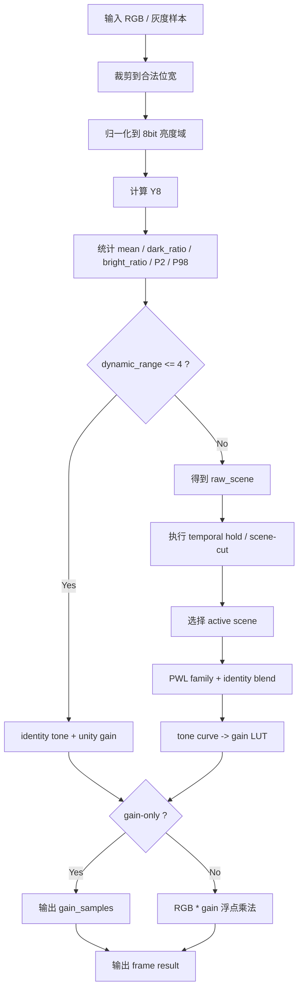
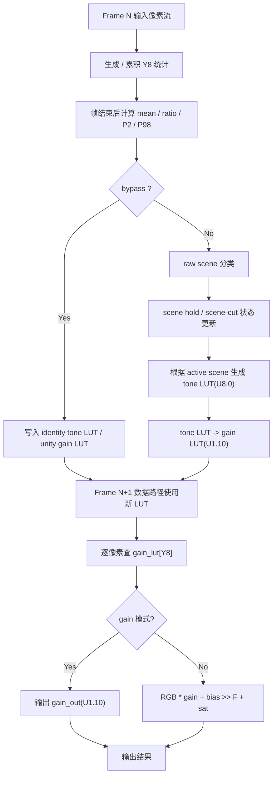

# 对比度增强算法设计说明

本文档面向算法、DDIC 数字实现、验证和 bring-up 团队，给出当前离散场景对比度增强算法的完整交付说明。文档同时覆盖：

- Python 浮点 golden：`scheme3/src/ce_scheme3/discrete_scene_gain_float.py`
- MATLAB 硬件运行时模型：`scheme3/matlab/ce_hw_control_update.m`、`scheme3/matlab/ce_hw_datapath.m`

说明约束：

- 文档统一使用中文
- 数学表达式统一使用代码块或行内代码，避免依赖不稳定的 Markdown LaTeX 渲染
- 浮点描述以 Python golden 为准
- 硬件描述以 MATLAB 运行时模型和当前配置约束为准
- 场景定义与 curve 节点优先遵守截图可见约束，并参考 `US8478042B2` 等 scene-adaptive tone/gamma 资料重建缺失部分

## 1. 问题定义与 I/O 契约

### 1.1 算法目标

本算法面向显示链路中的本地对比度增强 / gain 输出场景，目标是：

1. 对当前帧进行亮度统计，识别场景类型
2. 根据场景选择一组预定义 tone curve family
3. 生成 tone LUT 与 gain LUT
4. 在 gain-only 模式下输出每像素增益
5. 在本地 CE 模式下执行 `gain x RGB`
6. 在场景切换时通过 hold 机制抑制闪烁

算法不做在线复杂非线性拟合，核心思想是：

- 用少量统计量完成场景分类
- 用 PWL family 表达不同场景下的 tone 目标
- 用 scene strength 把 tone family 与 identity 曲线混合
- 用 `tone / input` 生成 gain LUT

### 1.2 输入定义

| 信号 | 域 | 位宽 | 说明 |
|---|---|---:|---|
| `rgb_in` | 原始 RGB 码值域 | 8 或 10 bit | 当前帧输入像素 |
| `y_in` | 亮度域 | 8 bit | 统计和 LUT 索引使用的统一亮度 |
| `cfg` | 配置域 | struct | 阈值、strength、knot、Q 格式等参数 |
| `prev_state` | 帧级状态域 | 若干寄存器 | 上一帧的 scene hold / scene-cut 状态 |
| `mode` | 模式控制 | 1 bit 等效 | `gain` 或 `rgb` |

### 1.3 输出定义

| 信号 | 域 | 位宽 | 说明 |
|---|---|---:|---|
| `scene_id` | 控制域 | 2 bit | 当前激活场景 |
| `raw_scene_id` | 控制域 | 2 bit | 未经过 hold 的瞬时场景 |
| `bypass_flag` | 控制域 | 1 bit | 低动态范围旁路标志 |
| `tone_lut` | tone LUT 域 | `256 x 8 bit` | 灰度映射表 |
| `gain_lut` | `U1.10` | `256 x 11 bit` | 增益查找表 |
| `gain_out` | `U1.10` | 每像素 11 bit | gain-only 模式输出 |
| `rgb_out` | 原始 RGB 码值域 | 8 或 10 bit | 本地 CE 输出 |
| `state_out` | 帧级状态域 | 若干寄存器 | 供下一帧使用的状态 |

### 1.4 浮点与硬件版本关系

两套版本遵循相同的算法骨架：

1. 输入归一化到 `Y_8`
2. 计算 `mean / dark_ratio / bright_ratio / P2 / P98`
3. 判定 `bypass_flag`
4. 判定 `raw_scene_id`
5. 用 temporal hold 机制决定最终 `scene_id`
6. 依据 `scene_id` 选择 tone curve
7. 由 tone curve 生成 gain LUT
8. 输出 gain 或执行 `gain x RGB`

差异主要在数值表示：

- 浮点版：
  - tone curve 用浮点保存
  - gain LUT 用浮点增益保存
  - RGB 输出直接使用浮点乘法后裁剪
- 硬件版：
  - tone LUT 固定为 `U8.0`
  - gain LUT 固定为 `U1.10`
  - `gain x RGB` 采用整数乘法、加 bias、右移回缩、饱和

## 2. 符号、变量与默认参数

### 2.1 符号表

| 符号 | 含义 | 取值范围 / 单位 |
|---|---|---|
| `R, G, B` | 输入 RGB 通道码值 | 8bit 或 10bit 整数 |
| `R_8, G_8, B_8` | 归一化到 8bit 域的 RGB 通道 | `[0, 255]` |
| `Y_8(i)` | 第 `i` 个像素的 8bit 亮度 | `[0, 255]` |
| `N` | 当前帧像素总数 | 正整数 |
| `mean` | 当前帧平均亮度 | `[0, 255]` |
| `dark_ratio` | 暗像素占比 | `[0, 1]` |
| `bright_ratio` | 亮像素占比 | `[0, 1]` |
| `P2` | 2% 百分位亮度 | `[0, 255]` |
| `P98` | 98% 百分位亮度 | `[0, 255]` |
| `dynamic_range` | 动态范围估计 | `[0, 255]` |
| `s_raw` | 瞬时场景分类结果 | `{Normal, Bright, Dark I, Dark II}` |
| `s_act` | 最终激活场景 | `{Normal, Bright, Dark I, Dark II}` |
| `F_f(x)` | family 曲线 | `[0, 255] -> [0, 255]` |
| `lambda_s` | 场景混合强度 | `[0, 1]` |
| `T_s(x)` | 场景 tone curve / tone LUT | `[0, 255] -> [0, 255]` |
| `G_s(x)` | 场景 gain LUT | 浮点或 `U1.10` |
| `gain_one` | 定点 1.0 的码值 | `2^gain_frac_bits` |
| `F` | gain 小数位数 | 默认 `10` |

### 2.2 默认场景阈值

| 参数 | 默认值 | 说明 |
|---|---:|---|
| `bypass_dynamic_range_threshold` | `4.0` | 低动态范围旁路阈值 |
| `bright_mean_threshold` | `176.0` | Bright 场景均值阈值 |
| `bright_ratio_threshold` | `0.25` | Bright 场景亮像素比例阈值 |
| `dark2_mean_threshold` | `48.0` | Dark II 均值阈值 |
| `dark2_ratio_threshold` | `0.85` | Dark II 暗像素比例阈值 |
| `dark2_bright_ratio_threshold` | `0.01` | Dark II 亮像素比例上限 |
| `dark1_mean_threshold` | `96.0` | Dark I 均值阈值 |
| `dark1_ratio_threshold` | `0.55` | Dark I 暗像素比例阈值 |
| `scene_cut_mean_delta` | `32.0` | 均值跳变导致立即切场的阈值 |
| `scene_switch_confirm_frames` | `2` | 待确认帧数 |

### 2.3 默认曲线族与强度

曲线 family 的 knot 定义如下：

```text
Family M = [(0,0), (64,40), (128,128), (192,224), (255,255)]
Family B = [(0,0), (96,64), (192,192), (224,236), (255,255)]
Family D = [(0,0), (48,24), (96,144), (192,232), (255,255)]
```

节点说明：

- `Family M` 对应截图中 `Normal scene` 与 `Dark scene II` 共用基础曲线
- `Family B` 强制经过 `(192,192)`，这只表示参考经过点，不把 `192` 当成真实拐点；真正的高光 shoulder 放在 `192` 之后
- `Family D` 不来自截图直读，而是参考 `US8478042B2` 等 scene-adaptive tone/gamma 资料，按 Dark I 的“保黑 + 提升中灰”目标重建

场景与 family 的映射如下：

| 场景 | 使用 family | strength |
|---|---|---:|
| `Normal` | `Family M` | `0.50` |
| `Bright` | `Family B` | `0.65` |
| `Dark I` | `Family D` | `0.70` |
| `Dark II` | `Family M` | `0.85` |

## 3. 算法总览

### 3.1 统一处理链路



### 3.2 总体公式

算法可以浓缩为下列几组公式：

```text
Y_8 = Luma(R, G, B)
stats = Stat(Y_8)
bypass = [P98(Y_8) - P2(Y_8) <= Th_bypass]
s_raw = SceneClass(stats)
s_act = SceneSelect(s_raw, prev_state, mean)
T_s = Blend(Identity, Family_s, lambda_s)
G_s(i) = T_s(i) / i, i > 0
output = GainOnly(G_s(Y_8)) 或 RGBScale(rgb_in, G_s(Y_8))
```

后续章节会分别把浮点版和硬件版按处理顺序详细展开。

## 4. 浮点版本算法说明

本节对应 Python golden：`scheme3/src/ce_scheme3/discrete_scene_gain_float.py`。

### 4.1 Step 1: 输入归一化

若输入是 RGB，则先把输入通道裁剪到合法位宽范围：

```text
clip_bit(x, B) = min(max(x, 0), 2^B - 1)
```

若输入位宽不是 8bit，则统一映射到 8bit 亮度域：

```text
norm_to_8bit(x, B) =
    x,                 B = 8
    floor(x / 2^(B-8)), B > 8
    min(255, x * 2^(8-B)), B < 8
```

亮度计算采用整数近似 BT.601 系数：

```text
Y_8 = clip((77*R_8 + 150*G_8 + 29*B_8 + 128) / 256, 0, 255)
```

变量说明：

- `R_8/G_8/B_8`：归一化后的 8bit RGB 通道
- `128`：用于四舍五入到最近整数
- `Y_8`：供统计和 LUT 索引使用的统一亮度

本步骤的目的不是视觉增强，而是把不同输入位宽统一到相同统计域，保证：

1. 阈值只需要维护一套
2. family 曲线固定为 `0..255`
3. LUT 地址固定为 8bit

### 4.2 Step 2: 计算帧级统计量

对一帧共 `N` 个亮度样本 `Y_8(i)`，逐项计算：

```text
mean = (1/N) * Σ Y_8(i)
dark_ratio = count(Y_8(i) <= 63) / N
bright_ratio = count(Y_8(i) >= 192) / N
```

为了估计动态范围，还要计算百分位：

```text
P2  = percentile(Y_8, 2)
P98 = percentile(Y_8, 98)
dynamic_range = P98 - P2
```

其中百分位采用排序后线性插值：

```text
rank = (N - 1) * p / 100
lower = floor(rank)
upper = min(lower + 1, N - 1)
blend = rank - lower
Pp = Y_sorted(lower) + blend * (Y_sorted(upper) - Y_sorted(lower))
```

变量说明：

- `Y_sorted(k)`：按从小到大排序后的第 `k` 个样本
- `p`：百分位，取 `2` 或 `98`
- `blend`：上下两个样本的线性插值权重

选择 `P98 - P2` 而不是 `max - min` 的原因是：

1. 对孤立噪声点不敏感
2. 更符合帧级对比度主分布
3. 有利于稳定 bypass 判决

### 4.3 Step 3: bypass 判决

若动态范围过小，说明当前帧本身接近平坦，继续增强容易放大噪声，因此直接旁路：

```text
bypass_flag = [dynamic_range <= bypass_dynamic_range_threshold]
```

默认阈值为：

```text
bypass_dynamic_range_threshold = 4.0
```

旁路时后续行为为：

```text
T_bypass(i) = i
G_bypass(0) = 0
G_bypass(i) = 1.0, i > 0
```

即：

- tone curve 使用 identity
- gain LUT 使用 unity gain
- 场景状态仍然更新，但本帧输出不做增强

### 4.4 Step 4: 原始场景分类

若不旁路，则根据帧级统计量得到瞬时场景 `s_raw`。

判定规则按顺序执行：

```text
if mean >= 176 and bright_ratio >= 0.25:
    s_raw = Bright
elif mean <= 48 and dark_ratio >= 0.85 and bright_ratio <= 0.01:
    s_raw = Dark II
elif mean <= 96 and dark_ratio >= 0.55:
    s_raw = Dark I
else:
    s_raw = Normal
```

详细解释如下：

1. 先判 `Bright`
   - 要求整体均值更高
   - 同时高亮像素占比足够大，避免“只是偏亮”就被误判成亮场
   - 避免局部高亮误判成全局亮场
2. 再判 `Dark II`
   - 要求均值很低
   - 大量像素集中在暗区
   - 且亮像素占比非常小
   - 这是最“纯”的暗场
3. 再判 `Dark I`
   - 比 `Dark II` 宽松
   - 允许暗场中存在一定中高灰
4. 都不满足时归入 `Normal`

### 4.5 Step 5: temporal hold 与 scene-cut

原始分类 `s_raw` 不直接作为输出场景，而是进入时域选择逻辑：

```text
scene_cut = [abs(mean_n - mean_(n-1)) >= scene_cut_mean_delta]
```

默认：

```text
scene_cut_mean_delta = 32.0
scene_switch_confirm_frames = 2
```

时域逻辑分四种情况：

1. 第一帧

```text
s_act = s_raw
```

2. 检测到 scene-cut 或关闭 hold

```text
s_act = s_raw
pending_scene = None
pending_count = 0
```

3. `s_raw == current_scene`

```text
s_act = current_scene
pending_scene = None
pending_count = 0
```

4. `s_raw != current_scene`

```text
若 s_raw != pending_scene:
    pending_scene = s_raw
    pending_count = 1
    s_act = current_scene
否则:
    pending_count += 1
    若 pending_count >= confirm_frames:
        s_act = s_raw
    否则:
        s_act = current_scene
```

这一步的作用是：

1. 抑制场景边界附近的抖动
2. 避免单帧异常统计造成 tone 曲线跳变
3. 在真正切场时又能通过 `scene_cut` 快速响应

### 4.6 Step 6: 生成 scene tone curve

每个 family 本质上是一条分段线性曲线：

```text
F_f(x), x ∈ [0, 255]
```

对每个灰度 `x`，先找到所属区间 `[x_k, x_(k+1)]`，再做线性插值：

```text
F_f(x) = y_k + (y_(k+1) - y_k) * (x - x_k) / (x_(k+1) - x_k)
```

然后将该 family 与 identity 曲线按场景强度混合：

```text
I(x) = x
T_s(x) = (1 - lambda_s) * I(x) + lambda_s * F_f(x)
```

详细解释：

1. `Family M`
   - 用于 normal 和 dark II
   - 是中等强度的基线曲线
2. `Family B`
   - 亮场曲线经过 `(192,192)` 参考点
   - 真正的高光 shoulder 放在 `192` 之后，因此高亮压缩集中在 `224~255`
3. `Family D`
   - 不来自截图直读，而是按 Dark I 的目标重建
   - 更偏向保留暗部黑位并提升中灰细节
4. `lambda_s`
   - 控制“目标 family”与“保真 identity”的折中
   - 越大，增强越强

### 4.7 Step 7: 由 tone curve 派生 gain LUT

tone curve 给出的是：

```text
输入灰度 i -> 输出灰度 T_s(i)
```

但数据路径需要的是乘法增益，因此定义：

```text
G_s(0) = 0
G_s(i) = clip(T_s(i) / i, 0, gain_max), i > 0
```

默认：

```text
gain_max = 1.75
```

变量说明：

- `T_s(i)`：tone curve 在灰度 `i` 处的目标输出
- `G_s(i)`：若输入灰度为 `i`，RGB 通道应乘以的增益

为什么要从 tone 推成 gain：

1. tone curve 更容易从算法角度设计
2. gain LUT 更适合硬件数据路径
3. 对 RGB 通道统一乘 gain 可以保留色度关系

### 4.8 Step 8: 浮点输出生成

对每个像素先查表：

```text
g(i) = G_s(Y_8(i))
```

若是 gain-only 模式，则：

```text
gain_out(i) = g(i)
```

若是 RGB 模式，则：

```text
R'(i) = min(R(i) * g(i), max_code)
G'(i) = min(G(i) * g(i), max_code)
B'(i) = min(B(i) * g(i), max_code)
```

这里不再做定点回缩，因为浮点版的职责是提供连续值黄金参考。

## 5. 硬件版本算法说明

本节对应 MATLAB 运行时模型：

- `scheme3/matlab/ce_hw_control_update.m`
- `scheme3/matlab/ce_hw_datapath.m`

硬件版本严格复用浮点版的算法顺序，但把关键量收敛到固定 Q 格式。

### 5.1 Step 1: 统一到统计域 `Y_8`

硬件控制路径和数据路径都以 `Y_8` 作为统一索引域：

```text
Y_8 = clip((77*R_8 + 150*G_8 + 29*B_8 + 128) >> 8)
```

其中：

- `R_8/G_8/B_8` 是把输入位宽归一化到 8bit 后的通道
- `>> 8` 等价于除以 `256`
- `+128` 用于 round-to-nearest

这一设计的意义是：

1. 所有阈值、LUT 和 histogram 都固定在 8bit 域
2. 控制路径不需要针对 8/10bit 分别维护一套曲线
3. 数据路径只需要一个 256 深度的 gain LUT

### 5.2 Step 2: 控制路径统计

控制路径统计量与浮点版一致：

```text
mean = (1/N) * ΣY_8(i)
dark_ratio = count(Y_8(i) <= 63) / N
bright_ratio = count(Y_8(i) >= 192) / N
dynamic_range = P98 - P2
```

但在硬件实现中可拆成两层：

1. 帧扫描累积
   - `sum_y`
   - `count_dark`
   - `count_bright`
   - histogram
2. 帧结束后计算
   - `mean`
   - `dark_ratio`
   - `bright_ratio`
   - `P2/P98`

实现解释：

- `mean`、ratio 可以在控制 CPU / 微码 / 帧级 FSM 中完成
- `P2/P98` 可以通过 histogram 累计计数求得
- 这些操作都属于 frame-level control，不进入像素主数据路径

### 5.3 Step 3: bypass 与场景分类

硬件版的判断公式与浮点版完全一致：

```text
bypass = [dynamic_range <= 4]
```

```text
Bright  : mean >= 176 and bright_ratio >= 0.25
Dark II : mean <= 48 and dark_ratio >= 0.85 and bright_ratio <= 0.01
Dark I  : mean <= 96 and dark_ratio >= 0.55
Normal  : otherwise
```

硬件上的实现重点不是公式本身，而是比较量的编码方式：

- `mean`：建议使用 `Q8.8` 或更高精度的控制路径定点
- `dark_ratio / bright_ratio`：建议使用 `Q0.8 ~ Q0.12`
- 阈值寄存器存储为同格式编码

### 5.4 Step 4: scene hold / scene-cut 状态机

硬件需维护 4 个关键状态：

| 状态 | 含义 | 建议位宽 |
|---|---|---:|
| `current_scene_id` | 当前激活场景 | 2 bit |
| `pending_scene_id` | 等待确认场景 | 2 bit |
| `pending_count` | 等待确认计数器 | 2~4 bit |
| `prev_mean` | 上一帧均值 | 16 bit 左右 |

scene-cut 公式：

```text
scene_cut = [abs(mean_n - prev_mean) >= 32]
```

逐步处理流程如下：

1. 若第一帧，没有历史状态
   - 直接 `current_scene_id = raw_scene_id`
2. 若 `scene_hold_enable = 0`
   - 直接 `current_scene_id = raw_scene_id`
3. 若检测到 `scene_cut = 1`
   - 认为当前帧与上一帧内容明显不同
   - 立即切到 `raw_scene_id`
4. 若 `raw_scene_id == current_scene_id`
   - 清空 pending 状态
   - 保持当前场景
5. 若 `raw_scene_id != current_scene_id`
   - 若与 pending 不同，则开启待确认
   - 若与 pending 相同，则计数加一
   - 计数达到门限后才真正切场

这是整个算法避免闪烁的核心控制逻辑。

### 5.5 Step 5: tone LUT 生成

硬件版的 tone LUT 最终存成 `U8.0`：

```text
tone_lut[i] = round(T_s(i))
```

其中 `T_s(i)` 来自分段线性 family 与 identity 的混合：

```text
T_s(i) = (1 - lambda_s) * i + lambda_s * F_f(i)
```

若旁路：

```text
tone_lut[i] = i
```

对硬件的好处是：

1. tone curve 可在帧级一次性生成
2. 运行时只需读 RAM，不做复杂函数计算
3. 256 点 LUT 足够覆盖 8bit 输入空间

### 5.6 Step 6: gain LUT 生成

硬件版使用 `U1.10` 编码：

```text
gain_one = 2^10 = 1024
gain_max_code = round(1.75 * 1024) = 1792
```

对 `i > 0`：

```text
gain_lut[i] = clip(round(tone_lut[i] * 1024 / i), 0, 1792)
gain_lut[0] = 0
```

逐步解释：

1. `tone_lut[i] / i` 是理想浮点增益
2. 乘 `1024` 后转成 `U1.10` 码值
3. 用 `round` 降低量化偏差
4. 最后裁剪到 `gain_max_code`

边界条件：

- `i = 0` 时不能做除法，因此固定为 `0`
- 小灰度区域理论增益可能很大，所以必须做上限裁剪

### 5.7 Step 7: gain-only 模式输出

若工作在 gain-only 模式，则数据路径只做：

```text
gain_out(i) = gain_lut[Y_8(i)]
```

这条路径最简单，等价于：

1. 计算 / 获取 `Y_8`
2. 查 `gain_lut`
3. 输出 `U1.10` 码值

它可以直接提供给外部模块使用，例如：

- CABC
- 其他背光 / 亮度调节逻辑

### 5.8 Step 8: RGB 数据路径

若工作在本地 CE RGB 模式，则每个通道做相同定点乘法。

设：

- 输入通道码值为 `C_in`
- 查表增益码值为 `g_code = gain_lut[Y_8]`
- 小数位数为 `F = 10`

则：

```text
mult_code = C_in * g_code
scaled = (mult_code + 2^(F-1)) >> F
C_out = sat_unsigned(scaled)
```

对 RGB 三通道分别执行：

```text
R_out = sat((R_in * g_code + 2^9) >> 10)
G_out = sat((G_in * g_code + 2^9) >> 10)
B_out = sat((B_in * g_code + 2^9) >> 10)
```

变量说明：

- `mult_code`：乘法中间结果
- `2^(F-1)`：round-to-nearest bias
- `>> F`：把 `U1.10` 增益的缩放因子消掉
- `sat()`：裁剪到合法输出范围，不允许 wrap

为什么这样实现：

1. 乘法器输出是整数，不保留浮点
2. 加 bias 再右移可近似四舍五入
3. 饱和裁剪比 wrap 更符合图像输出预期

## 6. 浮点与硬件版本逐项对照

| 处理阶段 | 浮点版 | 硬件版 |
|---|---|---|
| 输入归一化 | 浮点外壳下的整数裁剪与缩放 | 定点 / 整数缩放 |
| 亮度计算 | 浮点流程中保持整数公式 | `U8.0` 亮度索引 |
| 统计量 | `float` | 控制路径定点或软件辅助 |
| 场景分类 | 浮点阈值比较 | 同阈值，编码后比较 |
| tone curve | 浮点 PWL + blend | 最终量化为 `U8.0` LUT |
| gain LUT | 浮点 `tone / input` | `U1.10` 整数码值 |
| RGB 输出 | `channel * gain` 后裁剪 | 整数乘法、round、右移、饱和 |

对齐原则：

1. 浮点版负责表达算法意图
2. 硬件版负责表达可实现的数据通路
3. MATLAB 运行时模型位于中间层，既保留硬件语义，又便于验证

## 7. 定点实现策略

### 7.1 关键数据格式

| 信号 | 含义 | 实际范围 | Q 格式 | 编码范围 | 位宽 | 舍入 | 饱和 |
|---|---|---:|---|---:|---:|---|---|
| `Y_8` | 归一化亮度 | `[0,255]` | `U8.0` | `0..255` | 8 | `/256` + round | clip |
| `tone_lut[i]` | tone LUT 输出 | `[0,255]` | `U8.0` | `0..255` | 8 | `round` | clip |
| `gain_lut[i]` | 增益 LUT | `[0,1.75]` | `U1.10` | `0..1792` | 11 | `round` | clip |
| `mean` | 帧均值 | `[0,255]` | 建议 `Q8.8` | 设计相关 | 16 | round | clip |
| `dark_ratio` | 暗像素占比 | `[0,1]` | 建议 `Q0.8~Q0.12` | 设计相关 | 8~12 | round | clip |
| `bright_ratio` | 亮像素占比 | `[0,1]` | 建议 `Q0.8~Q0.12` | 设计相关 | 8~12 | round | clip |
| `mult_code` | 通道乘 gain 中间值 | `[0,1023*1792]` max | 整数域 | 设计相关 | 19~21 | - | - |
| `rgb_out` | 输出 RGB | `[0,255]` 或 `[0,1023]` | `U8.0/U10.0` | 合法码值域 | 8/10 | round shift | clip |

### 7.2 溢出与精度分析

1. `Y_8` 计算
   - 最大值为 `77*255 + 150*255 + 29*255 + 128 = 65280 + 128`
   - 右移 8 位后最大不超过 `255`
   - 16bit 中间寄存即可覆盖
2. `gain_lut`
   - 最大编码固定为 `1792`
   - 11bit 无符号足够
3. `RGB x gain`
   - 10bit 输入时最大乘积约为 `1023 * 1792 = 1833216`
   - 需要约 21bit 中间位宽
4. 精度损失
   - tone LUT 量化误差：不超过 `±0.5 LSB`
   - gain LUT 量化误差：不超过 `±0.5 / 1024`
   - RGB 乘法回缩误差：不超过 `±0.5 code`

### 7.3 舍入与饱和规则

- LUT 量化：使用 `round`
- gain LUT 编码：使用 `round`
- 乘法回缩：`(x + 2^(F-1)) >> F`
- 输出饱和：裁剪到合法 unsigned 区间
- 全流程禁止 wrap

## 8. 硬件资源估算

### 8.1 假设

- 输入按单像素流处理
- 统计和 LUT 生成属于帧级控制路径
- 数据路径按 8bit / 10bit 共用结构估算
- 运行时只保留一套激活 LUT

### 8.2 资源粗估表

| Block | Add/Sub | Mul/MAC | Compare | Mux | LUT/RAM | Notes |
|---|---:|---:|---:|---:|---:|---|
| 亮度归一化 | 2 add | 3 const mul | 1 clip | 0 | 0 | `77/150/29` 常数乘 |
| 帧级统计 | 3 累加器 + histogram 累加 | 0 | 3 阈值组 | 0 | `32 x counter_width` | 控制路径 |
| 百分位求解 | 1 running sum | 0 | 若干比较 | 0 | histogram 复用 | 控制路径 |
| scene hold | 2 add/sub | 1 abs-equivalent | 3~5 compare | 2 | 少量寄存器 | 控制状态机 |
| PWL tone 生成 | 2 add | 1 mul | 4 segment compare | 1 | knot ROM | 控制路径 |
| gain LUT 生成 | 1 add bias | 1 mul/div-like control op | 2 clamp compare | 0 | `256 x 11 bit` | 控制路径 |
| gain-only 数据路径 | 0 | 0 | 0 | 0 | 256 深 LUT | 查表输出 |
| RGB 数据路径 | 1 add / 通道 | 3 mul | 3 clip compare | 1 | 256 深 LUT | `gain x RGB` |

### 8.3 存储估算

- Tone LUT: `256 x 8 = 2048 bits`
- Gain LUT: `256 x 11 = 2816 bits`
- Histogram: `32 x counter_width`
- Scene 状态寄存器：小于 `64 bits`
- Knot 存储：
  - `3 family x 5 knot x 2 endpoint x 8 bit`
  - 大约 `240 bits` 量级

### 8.4 吞吐与时延建议

| 路径 | 目标 | 说明 |
|---|---|---|
| 控制路径 | 每帧更新 1 次 | 在 VBlank 或帧间隙完成 |
| 数据路径 | 1 pixel / cycle | LUT 查表 + 乘法 + 回缩 |
| Initiation Interval | `1` | 数据路径应支持连续像素流 |
| 延迟 | `2~4 cycles` 建议 | 取决于乘法与饱和流水线切分 |

## 9. 模块划分建议

| 代码实体 | 硬件归属 | 职责 |
|---|---|---|
| `ce_hw_config` | 配置寄存器 / 常量 ROM | 保存阈值、strength、knot、Q 格式 |
| `ce_hw_control_update` | 控制路径 | 统计、分类、hold、tone/gain LUT 生成 |
| `ce_hw_datapath` | 像素数据路径 | `Y_8` 索引、gain 查表、乘法、round、饱和 |
| `ce_hw_helpers` | 建模辅助 | MATLAB 仿真辅助，不直接映射独立模块 |

## 10. 详细流程图

### 10.1 浮点参考流程



### 10.2 硬件运行时流程



## 11. 验证计划与验收标准

### 11.1 验证目标

验证应覆盖以下三类一致性：

1. 浮点 golden 自洽
2. MATLAB 硬件运行时与浮点 golden 的数值趋势一致
3. 定点数据路径满足位宽、单调和饱和约束

### 11.2 推荐验证项

| 类别 | 内容 | 通过标准 |
|---|---|---|
| 场景分类 | Normal / Bright / Dark I / Dark II | `scene_id` 与预期一致 |
| bypass | 低动态范围输入 | `bypass_flag = 1` |
| tone LUT | 单调性检查 | `tone_lut[i+1] >= tone_lut[i]` |
| gain LUT | 范围检查 | `0 <= gain_lut[i] <= 1792` |
| gain-only | LUT 查表输出 | 与理论 gain 一致 |
| RGB 模式 | `gain x RGB` | 误差在定点量化允许范围内 |
| temporal hold | 场景边界抖动 | 不出现异常翻转 |
| scene-cut | 均值突变场景 | 能立即切换 |

### 11.3 推荐测试向量

- neutral ramp
- near-black ramp
- near-white ramp
- flat low dynamic range
- bimodal
- checkerboard
- dark background bright object
- bright background dark object
- noise on dark
- skin tone patch

### 11.4 定量验收建议

- MATLAB 运行脚本可正常执行：
  - `run_ce_hw_case.m`
  - `run_ce_hw_batch.m`
  - `validate_ce_hw_against_python.m`
- tone LUT 单调
- gain LUT 范围固定在 `0..1792`
- RGB 输出无负值、无溢出
- 与 Python golden 对齐时：
  - `max_abs`、`mean_abs`、`p95_abs` 保持在项目接受范围内
  - 若差异集中在高增益小灰度区域，应确认是否来自定点量化而非逻辑错误

## 12. 结论

该算法的本质是“场景感知的 PWL tone 选择 + gain LUT 数据路径实现”。从算法设计角度看，它避免了复杂在线优化；从硬件实现角度看，它把复杂度集中在帧级控制路径，把像素级数据路径收敛为：

1. 亮度索引生成
2. LUT 查表
3. 整数乘法
4. round
5. 饱和

因此它具备以下优点：

- 算法结构清晰，易于 handoff
- 曲线设计和阈值调参直观
- 硬件资源可控
- 浮点版、MATLAB 运行时、后续 RTL 之间具备清晰的追踪关系
