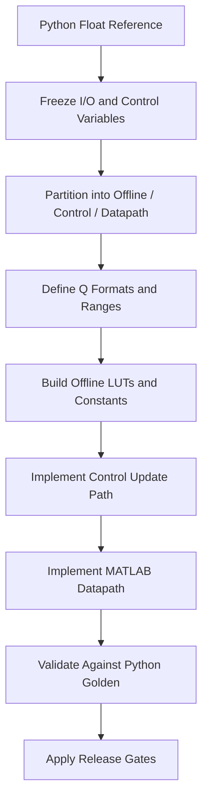

# Python 浮点参考实现转 MATLAB 硬件仿真通用标准

本文档定义一套项目无关的通用标准，用于将 Python 浮点参考实现迁移为 MATLAB 硬件仿真实现。

本文档不绑定任何具体算法、控制量、图像类型或项目目录。它只规定：

- 应该如何拆分算法
- 应该如何定义定点信号
- 应该如何组织 MATLAB 代码
- 应该如何验证“迁移完成”

如果某个具体项目需要实例，可另写项目专属文档；本文件只保留通用规则。

---

## 1. 目标与边界

### 1.1 目标

给定 Python 浮点参考实现 `f_ref`，构建 MATLAB 硬件仿真实现 `f_hw_matlab`，满足：

1. 算法行为与参考实现保持可验证的一致性
2. 核心运行路径采用硬件友好的表达
3. 中间信号的 Q 格式、舍入和饱和规则明确可查
4. 代码结构能自然映射到硬件中的常量存储、控制路径和数据路径

### 1.2 非目标

本标准默认不要求：

- bit-accurate RTL 一致
- 必须完全消除所有浮点运算
- 必须与 Python 逐行、逐变量结构一致

本标准允许保留少量“软件外壳”，但核心计算路径必须转为定点/硬件友好形式。

### 1.3 适用范围

适用于以下类型任务：

- 图像处理算法
- 视频逐帧算法
- 信号处理算法
- 逐样本或逐块计算算法
- 依赖查表、增益、插值、阈值、分段函数的控制算法

---

## 2. 通用术语与角色划分

### 2.1 参考实现

`Reference Implementation` 指 Python 浮点参考实现，满足：

- 数学行为定义完整
- 可运行
- 可作为 golden reference

它的作用是定义“算法想做什么”，不是定义“硬件应该怎么做”。

### 2.2 MATLAB 硬件仿真

`MATLAB HW Runtime` 指为硬件实现服务的 MATLAB 版本，满足：

- 结构接近硬件
- 中间量采用 raw code / fixed-point 语义
- 便于验证、可视化、资源估算和后续 RTL 迁移

### 2.3 三层结构

任何迁移都必须先拆成三层：

1. 离线层 `Offline Layer`
   - 高精度公式
   - 标定或拟合
   - LUT 生成
   - 常量表导出

2. 控制层 `Control Path`
   - 控制量更新
   - 模式切换
   - 运行时表展开
   - 帧级或块级参数更新

3. 数据层 `Datapath`
   - 逐像素、逐样本、逐向量、逐块运算
   - 核心乘加、查表、插值、裁剪、保护

结论：

- 不依赖当前样本值的计算，不允许留在数据层
- 不依赖控制量变化的静态数据，不允许留在控制层

---

## 3. 输入输出契约

每个迁移项目在开始实现前，都必须先固定 I/O 契约。

### 3.1 必须明确的输入

- 主输入数据
- 控制量
- 模式开关
- 配置参数
- LUT / 常量表来源

### 3.2 必须明确的输出

- 主输出数据
- 可选 debug 输出
- 可选中间信号抓取

### 3.3 必须明确的数据域

对每个输入输出，都要标明所属数据域：

- 浮点真实值域
- gamma 域 / linear 域 / 物理量域 / 归一化域
- raw code 整数域
- LUT 索引域

如果一个变量跨域变化，必须明确写出域变换位置。

---

## 4. 迁移前的强制分析步骤

在开始写 MATLAB 代码之前，必须先完成以下分析。

### 4.1 冻结参考路径

必须明确：

- Python 入口函数
- 配置对象
- 核心控制变量
- 关键分支
- 所有可选保护逻辑

如果参考路径尚不稳定，禁止开始迁移。

### 4.2 标记公式归属

对 Python 参考实现中的每一类公式，都必须回答：

- 它属于离线层吗？
- 它属于控制层吗？
- 它属于数据层吗？

推荐判断规则：

1. 若公式只与设计参数、标定参数、模型拟合有关，则归离线层
2. 若公式只在控制量变化时重算，则归控制层
3. 若公式必须对每个样本实时执行，则归数据层

### 4.3 识别不可直接保留的浮点操作

优先识别以下操作：

- `exp`
- `log`
- `pow`
- `sqrt`
- 三角函数
- 在线除法
- 在线矩阵求逆
- 在线高阶多项式

这些运算默认不应直接出现在硬件主路径。

---

## 5. 定点化通用规则

### 5.1 基本定义

设某信号使用 `F` 个小数位，则：

$$
S = 2^F
$$

实数转 raw code：

$$
x_{code} = \operatorname{round}(x_{real}\cdot S)
$$

raw code 转实数：

$$
x_{real} = \frac{x_{code}}{S}
$$

### 5.2 乘法重标定

若：

- `x` 使用 `F_x` 个小数位
- `y` 使用 `F_y` 个小数位

则乘积的小数位为：

$$
F_{mul} = F_x + F_y
$$

若目标输出要回到 `F_o` 个小数位，则：

$$
z_{code} = \left\lfloor \frac{x_{code}\cdot y_{code} + 2^{K-1}}{2^K} \right\rfloor
$$

其中：

$$
K = F_{mul} - F_o
$$

### 5.3 插值表达

若插值因子 `t` 为 `Q0.B`，则线性插值统一写为：

$$
v = v_0 + \left\lfloor \frac{t_{code}(v_1-v_0)+2^{B-1}}{2^B} \right\rfloor
$$

### 5.4 舍入策略

每个项目必须显式规定：

- `round to nearest`
- `floor`
- `truncate`
- `banker's rounding`

默认推荐：

- LUT 量化：`round`
- 乘法回缩：`round to nearest`
- 最终输出量化：按系统接口要求单独规定

### 5.5 饱和策略

每个项目必须显式规定：

- `saturate`
- `wrap`
- `clip to legal range`

默认推荐：

- 控制量与像素/样本主路径使用 `saturate`
- 除非硬件接口明确要求，不使用 `wrap`

### 5.6 位宽分析

每个主要信号都必须给出：

- 真实值范围
- Q 格式
- 编码范围
- 最小位宽
- 上溢风险
- 下溢风险

推荐使用统一表格：

| Signal | Meaning | Real Range | Q Format | Code Range | Width | Rounding | Saturation |
|---|---|---:|---|---:|---:|---|---|
| `x_code` | input sample | ... | ... | ... | ... | ... | ... |

---

## 6. 浮点到硬件友好表达的替换规则

### 6.1 替换优先级

当 Python 参考实现含有复杂浮点计算时，优先按以下顺序替换：

1. 常量表 / LUT
2. 分段线性
3. 常数乘法 + 移位
4. 低阶多项式近似
5. 小规模迭代

### 6.2 LUT 适用条件

优先用 LUT 的情况：

- 单输入非线性函数
- 控制量驱动的查表
- 可接受有限采样误差
- 资源比在线计算更优

### 6.3 分段线性适用条件

优先用分段线性的情况：

- 函数单调
- 局部线性近似效果好
- 可明确分段边界
- 控制逻辑可接受增加少量比较器

### 6.4 常数乘与移位

对于固定比例缩放，优先变换为：

- 左移/右移
- 常数乘法
- 预组合常数

不应保留通用除法，除非该除法：

- 明确只在控制层执行
- 或已有充分理由无法替换

### 6.5 可保留浮点外壳

以下内容可以保留为浮点，只要在文档中明确标注“非核心硬件路径”：

- 输入预处理
- 输出编码
- 可视化相关转换
- 调试用中间量回实数

---

## 7. MATLAB 代码组织标准

### 7.1 通用目录结构

推荐每个项目至少包含：

```text
matlab/<algo>_hw_runtime/
  README.md
  <algo>_hw_config.m
  <algo>_hw_control_update.m
  <algo>_hw_datapath.m
  run_<algo>_hw_case.m
  run_<algo>_hw_batch.m
  validate_<algo>_hw_against_python.m
```

其中：

- `<algo>` 是项目算法名
- 若不是图像算法，禁止把文件名写死成 `image`

### 7.2 `*_hw_config.m`

责任：

- 默认参数
- 位宽
- scale factor
- 常驻 LUT
- 阈值
- 参数合法性检查

禁止：

- 主输入数据处理
- 控制层动态更新
- 数据层逐样本处理

### 7.3 `*_hw_control_update.m`

责任：

- 控制量裁剪
- runtime 参数重建
- control-path LUT 展开
- 帧级/块级参数准备

禁止：

- 遍历主输入数据
- 最终输出量化

### 7.4 `*_hw_datapath.m`

责任：

- 数据域转换
- 查表或插值
- 乘加与位移
- 裁剪
- 可选保护逻辑

要求：

- 变量命名体现数据域
- 核心中间量带注释说明 Q 格式
- 每个右移步骤说明 rounding bias

### 7.5 `run_*`

责任：

- 组织单 case 或批量运行
- 输出文件命名
- 保存结果
- 打印关键信息

### 7.6 `validate_*`

责任：

- 加载 Python golden
- 调用 MATLAB 硬件仿真
- 输出误差统计
- 为定位误差提供依据

---

## 8. 命名和注释标准

### 8.1 命名

统一建议：

- 浮点真实值：`*_f`
- 定点整数码值：`*_code` 或 `*_fixed`
- 查表：`*_lut`
- 运行时表：`runtime_*`
- 控制量：`ctrl_*` 或项目专属名
- scale factor：`ONE`, `HALF`, `COEFF_ONE`, `COEFF_HALF` 等

### 8.2 注释

每个关键函数都必须说明：

- 输入输出的域
- 关键中间信号的 Q 格式
- 该函数属于离线层、控制层还是数据层
- 近似或保护逻辑存在的原因

### 8.3 禁止事项

禁止：

- 在同一个变量名中混合真实值和 raw code 语义
- 依赖 MATLAB 默认类型行为表达硬件规则
- 用“经验写法”省略量化或裁剪

---

## 9. 通用数据流标准

任何项目都可以按以下抽象流水描述：



控制路径与数据路径应一一对应于文档描述，不允许文档写一套、代码实现另一套。

---

## 10. 验证标准

### 10.1 必需的两类验证

每个项目必须至少包含两类验证：

1. 数值对齐验证
2. 行为或质量验证

### 10.2 数值对齐验证

数值对齐验证至少输出：

- `max_abs`
- `mean_abs`
- 高分位误差，如 `p95` 或 `p99`

必要时增加：

- 每层中间信号误差
- 分段边界误差
- 极值输入误差

### 10.3 行为/质量验证

根据项目类型选择：

- 图像类：视觉 gate
- 信号类：频响、SNR、幅相误差、收敛性
- 控制类：状态转移正确性、阈值边界稳定性

原则：

- 数值对齐用于 debug
- release gate 由项目目标决定
- 不应把“逐点更接近 golden”误判为“项目效果更好”

### 10.4 边界验证

必须覆盖：

- 最小输入
- 最大输入
- 阈值边界
- 分段边界
- 控制量边界
- neutral / bypass / identity 档位

---

## 11. 资源估算标准

每个迁移项目都应输出粗粒度资源估算。

至少统计：

- 加法/减法数量
- 乘法/MAC 数量
- 比较器数量
- mux 数量
- LUT/RAM 占用
- 关键寄存器位宽
- 预估延迟层级

推荐模板：

| Block | Add/Sub | Mul/MAC | Compare | Mux | LUT/RAM | Notes |
|---|---:|---:|---:|---:|---:|---|
| Control update | ... | ... | ... | ... | ... | ... |
| Datapath core | ... | ... | ... | ... | ... | ... |

---

## 12. 迁移完成的验收条件

只有当以下条件全部满足时，才可以声称迁移完成：

1. Python 参考路径已冻结并被记录
2. 算法已完成离线层、控制层、数据层拆分
3. 所有关键信号已定义 Q 格式和范围
4. MATLAB 代码已按角色拆分，不是单文件堆叠
5. 复杂浮点运算已替换为硬件友好表达，或明确保留为外壳
6. Python golden 对齐验证可运行
7. 项目专属 release gate 已定义
8. 资源估算已给出

---

## 13. 一页式执行清单

迁移新项目时，按下面顺序执行：

1. 确认 Python 版本是 golden reference
2. 固定输入、输出、控制量、模式开关
3. 标记每个公式属于离线层、控制层还是数据层
4. 清理所有不应进入主路径的浮点操作
5. 定义所有主要信号的 Q 格式与位宽
6. 生成常驻表与运行时表
7. 先写 `config`
8. 再写 `control_update`
9. 再写 `datapath`
10. 最后写 `run` 与 `validate`
11. 执行数值对齐
12. 执行项目专属 release gate

如果缺少上述任一步，本标准视为未完整执行。

---

## 14. 项目专属文档的关系

本文件是通用 standard。

对于每个具体项目，建议再补一份项目文档，说明：

- 项目控制量含义
- 具体 LUT 来源
- 具体近似策略
- 项目专属验证集
- 项目专属放行标准

关系应保持为：

- 本文件：规定方法
- 项目文档：规定实例

